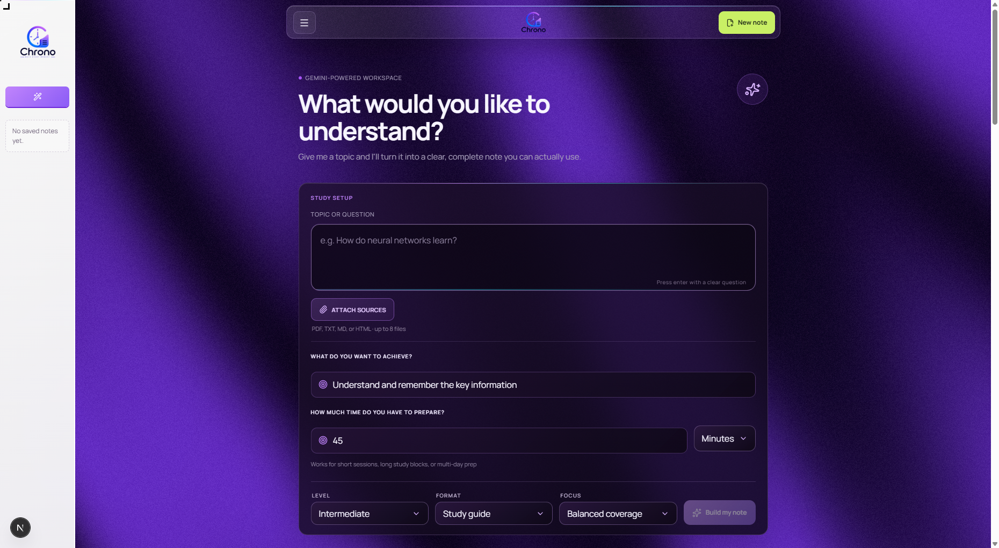
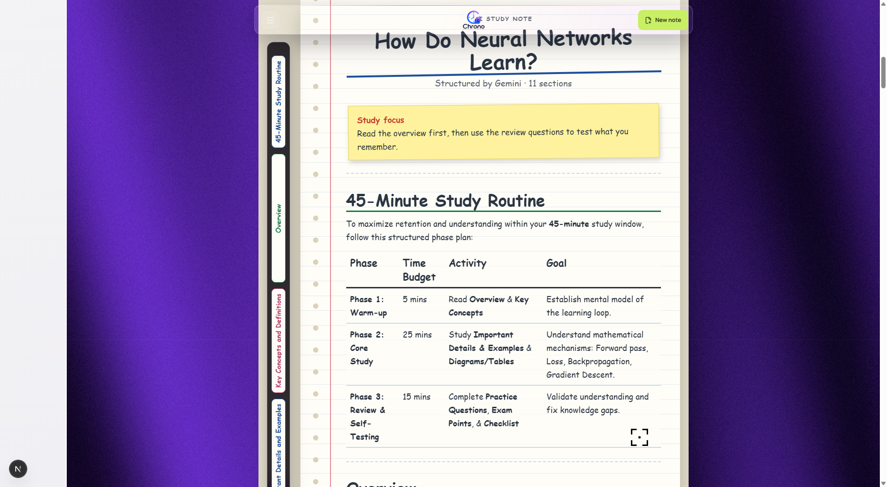
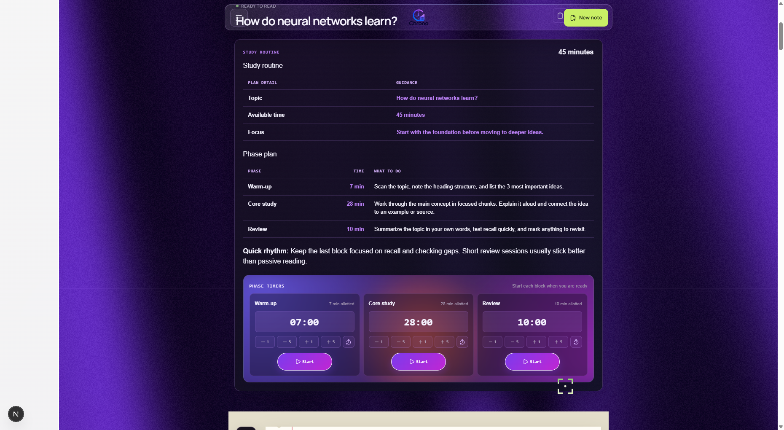

# Chrono Notes

Chrono Notes is a focused AI study workspace powered by Google Gemini. Give it a topic or question, optionally attach source material, and generate a structured study note tailored to your level, learning goal, focus, and available preparation time.

The app is designed for active learning rather than passive summarization. Generated notes can include explanations, definitions, examples, tables, diagrams, review questions, takeaways, and a practical study routine. 

## Demo

 

The screenshot shows the Chrono Notes workspace with its personalized study setup, animated atmosphere, FAQ, and saved-note workflow. 

### Generated Study Note



This example was generated from the question “How do neural networks learn?” and includes structured sections, a study focus, explanations, examples, and review material.

### Study Routine and Timers



Each generated note can include a preparation plan with warm-up, core study, and review phases. The phase timers can be started, paused, adjusted, and reset independently.

## Features

- Generate study notes from a topic or question.
- Tailor output for beginner, intermediate, or advanced learners.
- Choose a `Study guide`, `Deep dive`, or `Cheat sheet` format.
- Select a learning focus such as balanced coverage, practical examples, or exam preparation.
- Describe the goal for the session, such as exam preparation or remembering key information.
- Set preparation time in minutes, hours, or days.
- Attach up to 8 source files per note.
- Support PDF, TXT, Markdown, and HTML sources.
- Keep source-based answers grounded in the attached material.
- Render Markdown, GitHub-flavored Markdown, and LaTeX math.
- Use generated warm-up, core study, and review timers.
- Copy note content, open an HTML version, or download an HTML file.
- Save up to 20 notes in the browser’s local storage.
- Search, rename, reopen, and delete saved notes.
- Switch between Silk and Grainient animated workspace themes.

## Requirements

- Node.js 20 or newer recommended.
- npm.
- A Google Gemini API key from [Google AI Studio](https://aistudio.google.com/app/apikey).

## Getting Started

Install the dependencies:

```bash
npm install
```

Create a file named `.env.local` in the project root:

```env
GEMINI_API_KEY=your_gemini_api_key_here
```

Start the development server:

```bash
npm run dev
```

Open [http://localhost:3000](http://localhost:3000) in your browser, enter a topic, and select **Build my note**.

The API key is read only by the server route. Keep it in `.env.local`, which should remain uncommitted. Never place the key in a client component or expose it in browser code.

## Source Files

Chrono accepts a maximum of 8 files for one generation request. Each file may be up to 20 MB.

| Type | Processing |
| --- | --- |
| PDF | Sent to Gemini as document data |
| TXT | Read and included as text |
| Markdown | Read and included as text |
| HTML | Cleaned of scripts and styles, then included as text |

Text sources are limited to the model context budget. If text is truncated or omitted, the generated note is told not to treat the missing content as evidence. Always verify important claims against your original materials.

## Study Routine

When a note is generated, Chrono creates a time-aware routine with three phases:

1. **Warm-up:** scan the topic and identify important ideas.
2. **Core study:** work through the main concepts and examples.
3. **Review:** test recall, summarize, and identify gaps.

Each phase has an independent timer that can be started, paused, adjusted, or reset.

## Saved Notes and Privacy

Saved notes are stored in the current browser using `localStorage`. They are not synchronized between browsers or devices, and clearing browser storage removes them. The library stores up to 20 notes and includes the settings used to generate each note.

Do not upload confidential, private, or regulated information unless you understand the implications of sending that material to the configured Gemini service. AI-generated notes should be reviewed before being used for exams, professional work, or important decisions.

## Exporting Notes

The note toolbar provides three actions:

- Copy the generated Markdown content.
- Open a styled HTML version in a new browser tab.
- Download the styled note as an `.html` file.

## Project Structure

```text
src/
	app/
		api/generate/       Gemini generation route and source handling
		components/         Animated backgrounds, navigation, and cursor
		page.tsx            Main Chrono Notes workspace
		controls.css        Workspace and content styling
		reactbits.css       Theme and atmosphere styling
		layout.tsx          App metadata, fonts, and global styles
	lib/
		studyRoutine.ts     Preparation-time normalization and phase planning
```

## Available Commands

```bash
npm run dev       # Start the development server
npm run build     # Create a production build
npm run start     # Start the production server after building
npm run lint      # Run ESLint
npx tsc --noEmit  # Run the TypeScript checker
```

The current `lint` script uses ESLint 9, but the repository does not yet include an `eslint.config.js`, `eslint.config.mjs`, or `eslint.config.cjs`. Add a flat ESLint configuration before relying on `npm run lint` in CI.

## Technology

- Next.js 16
- React 19
- TypeScript
- Google Gemini API
- React Markdown with GitHub-flavored Markdown and KaTeX support
- OGL, Three.js, and React Three Fiber for animated backgrounds
- Lucide React for interface icons
